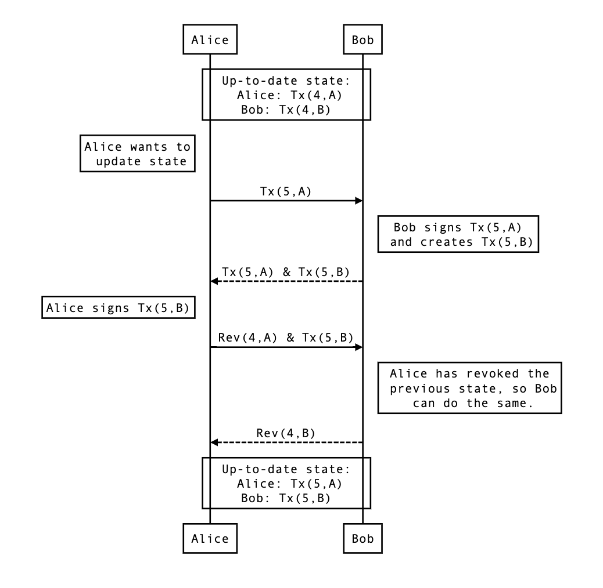

## Introduction

Lightning is a scaling protocol for Bitcoin, and we've done our best to imitate that here.

## Components

1. **Node**
   - First, we'll be implementing the **[SegWit](https://en.wikipedia.org/wiki/SegWit)** protocol, which allows us to fit more transactions in each block. Second, we'll be accomodating our new Lightning node!
2. **LightningNode**
   - Like our normal nodes, lightning nodes run their own server, deal with transactions, and have a collection of other (lightning) peers. Unlike our normal nodes, lightning nodes keep track of channels, which keep track of transactions without having to broadcast everything to the main network.
3. **Channel**
   - Once a channel is opened between two parties and backed by a transaction on the main network, channel members can send updated transactions back and forth without having to broadcast all minor updates to the main chain. Think of all the pesky fees and time saved! When one party decides to "settle," they simply broadcast the most recent transaction to the main network.
4. **Watchtower**
   - Since every transaction in a channel is technically valid, we have to employ the services of a watchtower to ensure that our counterparty doesn't cheat and broadcast an outdated transaction! The watchtower will keep a collection of all revocation keys for past transactions, ensuring that if the counterparty does decide to cheat, they'll be caught (and lose all of their coins in the process)!
5. **Server**
   - Two servers. First, **SegWit** protocol on the node's server. Then the lightning protocol on the lightning node's server.

# Code References for Various Cryptocurrency Components

Below is a list of various components of the cryptocurrency ecosystem, along with the corresponding code references:

## SegWit

- `pkg/node.go: BroadcastTransaction`
- `pkg/server.go: GetWitnesses`
- `pkg/server.go: ForwardTransaction`

## Wallet

- `pkg/wallet.go: GenerateFundingTransaction`
- `pkg/wallet.go: HandleRevokedOutput`

## Lightning Server

- `lightning/server.go: OpenChannel`
- `lightning/server.go: GetUpdatedTransactions`
- `lightning/server.go: GetRevocationKey`

## Lightning

- `lightning/channel.go: CreateChannel`
- `lightning/lightningnode.go: UpdateState`
- `lightning/watchtower.go: HandleBlock`

# SegWit: Increasing Bitcoin's Scalability

The Segregated Witness (SegWit) protocol is a soft fork implemented in Bitcoin that has been widely embraced by the community. It works by separating the transaction data from the signature data (the "witnesses"), allowing for more transactions to be included in each block.

Removing signature data from blocks results in more space for transactions, which in turn increases the throughput of the network. It's been estimated that signatures can take up as much as 65% of a block's capacity. By segregating the witnesses, Bitcoin's scalability significantly improves.

While it's unclear whether miners will receive more fees in the long term due to this protocol, it's undeniable that SegWit has contributed to improving the overall efficiency and speed of Bitcoin transactions.

# Lightning Server: Handling Requests and Updating State

A Lightning node operates through its own server, which allows it to receive and respond to requests from other Lightning nodes. I implemented the server-side responsibilities of a Lightning node, such as handling requests for opening channels, updating transaction information, and revocation key requests.

Updating the State Protocol:
In a Lightning channel, both parties (e.g. Alice and Bob) have their own versions of each state. This is because the revocable outputs are different for each side. For example, Tx(1,A) represents Alice's transaction for state 1, while Rev(3,B) is Bob's revocation key for his transaction at state 3.

Here's an example of how the state update protocol works: suppose Alice and Bob already have a channel set up, and Alice wants to pay Bob. In this case, Alice initiates the protocol. If Bob wanted to pay Alice instead, the process would be inverted.

# Lightning

Now we’re taking on Alice’s side of the protocol. An owner of a lightning node probably wants to establish a couple of channels, so that they have more opportunities to take part in multi-channel hops and hopefully collect some routing fees along the way!

Updating State Protocol:
Here’s the protocol from above, for easier reference.

